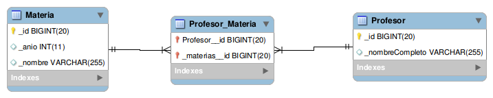

# Ejemplo Profesores y Materias

[](https://travis-ci.com/uqbar-project/eg-profesores-springboot)

## Prerrequisitos

- Necesitás instalar un motor de base de datos relacional (te recomendamos [MySQL](https://www.mysql.com/) que es OpenSource y gratuito)
- En MySQL: hay que crear una base de datos facultad. No hay que correr los scripts, las tablas se recrean cada vez que se levanta la aplicación.

``` sql
CREATE SCHEMA facultad;
```

- Revisá la password para conectarte a la base en el archivo [`application.yml`](./src/main/resources/application.yml):

```yml
    datasource:
        url: jdbc:mysql://localhost/facultad
        username: root
        password:   # acá podés dejarla en blanco si no tenés contraseña o escribir la tuya
```

## Objetivo

Un profesor dicta una o varias materias, y a su vez cada materia es dictada por varies profesores. La solución muestra cómo se traduce esta relación en

- el modelo de objetos, donde simplemente tenemos una colección de materias en profesor (y podríamos tener eventualmente una colección de profesores en materia)
- el modelo relacional, que requiere una entidad que relacione profesor y materia mediante claves foráneas que referencien a sus identificadores. Esto no necesita de una entidad extra en el modelo de objetos porque de esa relación no nacen atributos (aunque podrían, si quisiéramos guardar por ejemplo la fecha en la que el profesor comenzó a dar la materia)

## Endpoints comunes

- `GET ./profesores/`: devuelve la lista de profesores, sin las materias
- `GET ./profesores/{id}`: devuelve los datos de un profesor con sus materias
- `GET ./materias/`: devuelve la lista de materias
- `PUT ./profesores/{id}`: actualiza un profesor con los datos del body

## Endpoint especial

- GET | `./materias/{id}`: devuelve una materia, con sus profesores. 

Una decisión de diseño importante que tomamos fue **no tener referencias bidireccionales** (de profesor a materias y de materia a profesores). El primer motivo es didático, el segundo es que mantener esa relación bidireccional tiene un costo y debemos decidir quién es el dueño de esa relación (para no entrar en loop al agregar un profesor a una materia, además del agregado en cada una de las colecciones). Pueden consultar [este post de Stack overflow](https://stackoverflow.com/questions/22461613/pros-and-cons-of-jpa-bidirectional-relationships) para más información.


Como consecuencia de nuestra decisión de diseño, la materia no tiene la lista de profesores, pero nosotros queremos que este endpoint:

```bash
http://localhost:8080/materias/2
```

nos devuelva

```json
{
    "id": 2,
    "nombre": "Paradigmas de Programacion",
    "anio": 2,
    "profesores": [
        {
            "id": 4,
            "nombre": "Lucas Spigariol"
        },
        {
            "id": 5,
            "nombre": "Nicolás Passerini"
        }
    ]
}
```

Para ello vamos a necesitar dos pasos:

1. Aprovechar que el modelo relacional nos permite hacer un JOIN partiendo de cualquiera de las entidades (tiene una navegación más flexible que el modelo de grafo de objetos). Haremos un query en [JPQL](https://es.wikipedia.org/wiki/Java_Persistence_Query_Language) (Java Persistence Query Language), una variante de SQL que trata de acercarse más al paradigma de objetos.

```xtend
	@Query("SELECT m.id as id, m.nombre as nombre, m.anio as anio, p.id as profesorId, p.nombreCompleto as profesorNombre FROM Profesor p INNER JOIN p.materias m WHERE m.id = :id")
	def List<MateriaFullRowDTO> findFullById(Long id)
```

El resultado de esa consulta son n registros, porque es el producto cartesiano de 1 materia con n profesores.

El DTO es una interfaz, donde por convención los atributos se corresponden con el alias que le pusimos en el query:

```xtend
@Data
class MateriaDTO {
	Long id
	String nombre
	int anio
	List<ProfesorDTO> profesores
}
```

Podemos mapear el atributo de nuestro DTO con otro nombre, mediante la anotación `@Value`:

```xtend
interface MateriaFullRowDTO {
  def Long getId()
  @Value("#{target.nombre}") // el formato es "target".{atributo del query}
  def String getNombreLindo()
  ...
}
```

2. Como queremos que el endpoint devuelva una sola entidad materia, vamos a agrupar todos los profesores en una lista, y tomaremos la información de la materia una sola vez (porque sabemos que las otras filas simplemente repiten el dato):

```xtend
@GetMapping(value="/materias/{id}")
def getMateria(@PathVariable Long id) {

  // Recibimos n registros de materias
  val materiasDTO = this
    .materiaRepository
    .findFullById(id)
    
  if (materiasDTO.empty) {
    throw new ResponseStatusException(HttpStatus.NOT_FOUND, "La materia con identificador " + id + " no existe")
  }
  
  // Agrupamos los profesores de la materia
  val materia = materiasDTO.head
  val profesores = materiasDTO.map [ materiaDTO |
    new ProfesorDTO(materiaDTO.profesorId, materiaDTO.profesorNombre) 
  ]
  new MateriaDTO(materia.id, materia.nombreLindo, materia.anio, profesores)
}
```

## Testing

Como cuenta [este artículo](https://www.testim.io/blog/unit-test-vs-integration-test/), tenemos que tomar una decisión de diseño sobre cómo testear este componente que creamos. Sabemos que

- los tests unitarios prueban una unidad funcional, no trabajan con la base de datos ni con la red, como consecuencia **son más rápidos de ejecutar y más fáciles para generar y mantener**. Como contrapartida, necesitan mecanismos para simular efectos, operaciones costosas o donde interviene el azar, y es importante entender que eso reduce la eficacia para encontrar problemas.
- por otra parte, los tests de integración son bastante más costosos de elaborar, porque están probando la integración de varios componentes de nuestra arquitectura.

En este caso nos vamos a concentrar más en los segundos tipos de tests, principalmente porque el dominio tiene pocas reglas de negocio (decisión didáctica que nos permite concentrarnos más en la persistencia), y porque Springboot también nos ayuda a tener una solución declarativa: casi no hay líneas en la definición del repositorio. En una aplicación comercial, los tests unitarios nos ayudan a iniciar el desarrollo (sobre todo si aplicamos TDD) y **complementan** a los tests de integración, que por su costo suelen ser más escasos y se concentran en los caminos frecuentes que realiza el usuario. No es una decisión excluyente, necesitamos ambos tipos de tests en nuestra arquitectura.

### Implementación del primer test de integración

Veamos entonces cómo Springboot nos ayuda a construir un entorno de testing que comienza en el endpoint (el Controller), pasa al repositorio y se apoya en los objetos de dominio:

```xtend
	@Test
	@DisplayName("podemos consultar todos los profesores")
	def void profesoresHappyPath() {
		val responseEntity = mockMvc.perform(MockMvcRequestBuilders.get("/profesores")).andReturn.response
		val profesores = responseEntity.contentAsString.fromJsonToList(Profesor)
		assertEquals(200, responseEntity.status)
		assertEquals(3, profesores.size)
		// los profesores no traen las materias
		assertEquals(0, profesores.head.materias.size)
	}
```

El mismo mecanismo de bootstrap que crea los profesores para levantar la aplicación es el que estamos utilizando en los tests, solo que en lugar de trabajar con una base de datos real estaremos usando una base relacional en memoria, H2. Esto se configura en la clase de test:

```xtend
@SpringBootTest
@AutoConfigureMockMvc
@ActiveProfiles("test")
@DisplayName("Dado un controller de profesores")
class ProfesorControllerTest {
```

La anotación ActiveProfiles que contiene el valor `test` por convención nos permite definir en un archivo `application-test.yml` la conexión a la base en memoria:

```yml
spring:
    database: H2
    h2:
        console:
            enabled: true
            path: /h2
    datasource:
        url: jdbc:h2:mem:test
        username: sa
        password: sa
        driver-class-name: org.h2.Driver
    ...
```

En general el nombre es `application-XXX.yml` donde XXX será el valor que le pasaremos a la anotación ActiveProfiles.

### Tipos de tests de Springboot

La segunda anotación que queremos comentar es `@SpringBootTest` que es el que nos permite ejecutar tests de integración. Otras variantes son

- `@DataJpaTest`: útil si queremos hacer el test de integración únicamente contra el repositorio (en el ejemplo nosotros queremos testear la integración del controller con el repositorio). Esto automáticamente configura la base H2 en memoria, sin necesidad de configurarlo nosotros manualmente.
- `@WebMvcTest`: los conocerán previamente si estuvieron haciendo test de integración de los endpoints, porque levantan un entorno de prueba más rápido que el web server. El tema es que si queremos trabajar con repositorios, tenemos que trabajar con la anotación `@MockBean` que nos permite generar un _mock_ del mismo. Entonces la prueba que estamos haciendo no es completa.
- `@SpringBootTest`: es el que nos permite generar un entorno de prueba completo, donde no se mockee repositorios ni ningún otro componente, y por lo tanto es el que utilizamos en este caso.

Para más información recomendamos leer [el artículo de Springboot de Baeldung](https://www.baeldung.com/spring-boot-testing)

### Ver datos de un profesor

En este test queremos traer el dato de un profesor:

```xtend
	@Test
	@DisplayName("al traer el dato de un profesor trae las materias en las que participa")
	def void profesorExistenteConMaterias() {
		val responseEntity = mockMvc.perform(MockMvcRequestBuilders.get("/profesores/" + ID_PROFESOR)).andReturn.response
		assertEquals(200, responseEntity.status)
		val profesor = responseEntity.contentAsString.fromJson(Profesor)
		assertEquals(2, profesor.materias.size)
	}
```

Para ello definimos el identificador del profesor como el número 1, de tipo long (por eso el sufijo `L`):

```xtend
	static val ID_PROFESOR = 1L
```

Para estar seguros de que el identificador 1 existe, el atributo `id` de la entidad Profesor tiene que apuntar a una secuencia autoincremental que sea exclusiva de la tabla de profesores, esto se hace de la siguiente manera:

```xtend
	@Id
	// El GenerationType asociado a la TABLE es importante para tener
	// una secuencia de identificadores única para los profesores
	// (para que no dependa de otras entidades anteriormente creadas)
	@GeneratedValue(strategy = GenerationType.TABLE)
	Long id
```

Es importante tener el control del identificador que se genera porque es nuestro punto de entrada para hacer el pedido get al controller. Luego validamos que

- nos devuelva un código http 200
- y que además la información del profesor contenga las materias que da ese docente

### Test de actualización

Por último, tenemos un test de integración que va a producir un efecto colateral. En este caso vamos a

- tomar la información de un profesor
- producir un efecto (dictará una materia nueva) y persistir ese efecto haciendo una llamada http PUT
- hacer la llamada GET verificando que el efecto se persitió (comparando con el valor que tenía antes del cambio)
- y por último, desharemos el cambio manualmente para eliminar la dependencia entre tests (de lo contrario el orden en el que evaluemos los casos de prueba pueden ser exitosos o fallidos, lo que se conoce como [_flaky test_](https://engineering.atspotify.com/2019/11/18/test-flakiness-methods-for-identifying-and-dealing-with-flaky-tests/))

```xtend
	@Test
	@DisplayName("podemos actualizar la información de un profesor")
	def void actualizarProfesor() {
		val profesor = getProfesor(ID_PROFESOR)
		val materias = repoMaterias.findByNombre("Diseño de Sistemas")
		assertEquals(1, materias.size)
		val materiaNueva = materias.head
		profesor.agregarMateria(materiaNueva)
		updateProfesor(ID_PROFESOR, profesor)
		val nuevoProfesor = getProfesor(ID_PROFESOR)
		val materiasDelProfesor = profesor.materias.size
		assertEquals(materiasDelProfesor, nuevoProfesor.materias.size)
		// Pero ojo, como esto tiene efecto colateral, vamos a volver atrás el cambio
		profesor.quitarMateria(materiaNueva)
		updateProfesor(ID_PROFESOR, profesor)
	}
```

## Material adicional

- [Artículo de Baeldung](https://www.baeldung.com/jpa-many-to-many), donde define la relación en forma bidireccional
- [Artículo de Stack Overflow](https://stackoverflow.com/questions/42394095/many-to-many-relationship-between-two-entities-in-spring-boot)
- [Testeo unitario y testeo de integración](https://www.testim.io/blog/unit-test-vs-integration-test/)

## Diagrama entidad-relación



